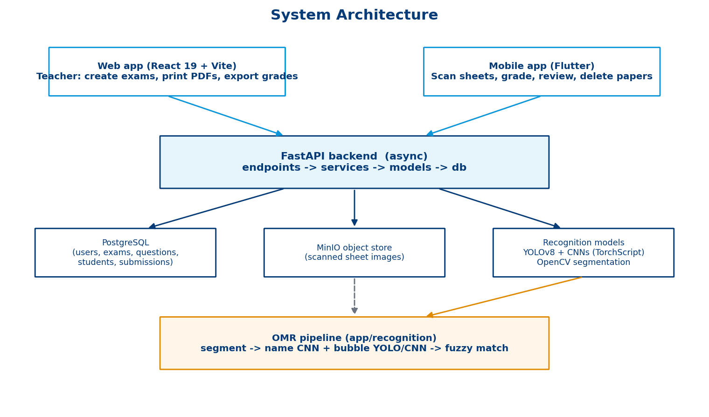
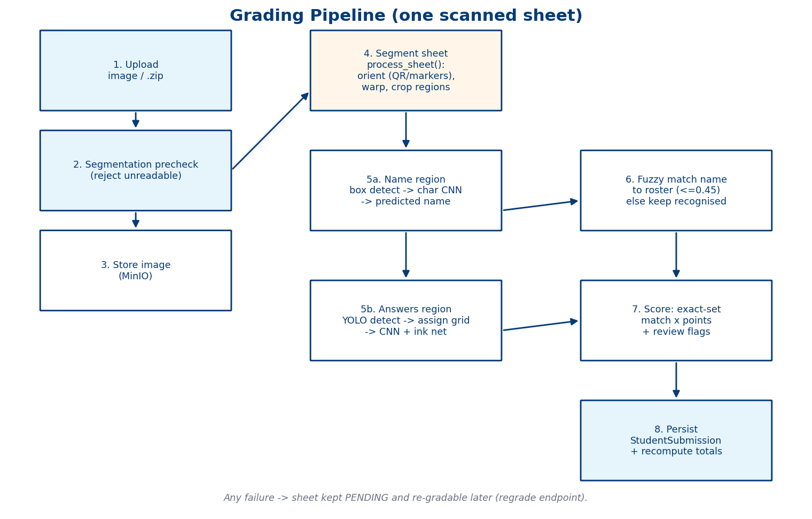
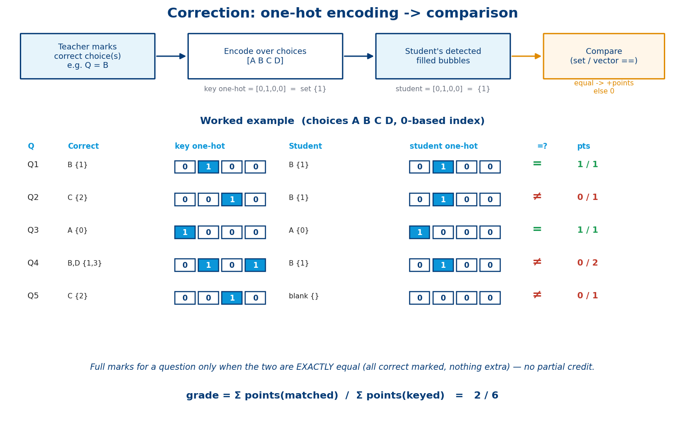
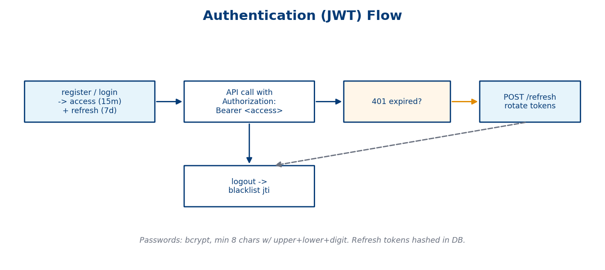
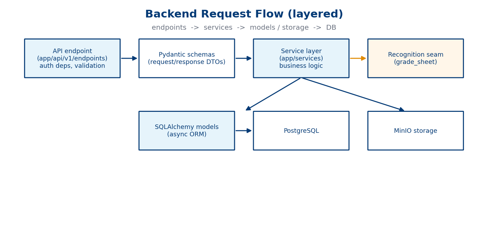
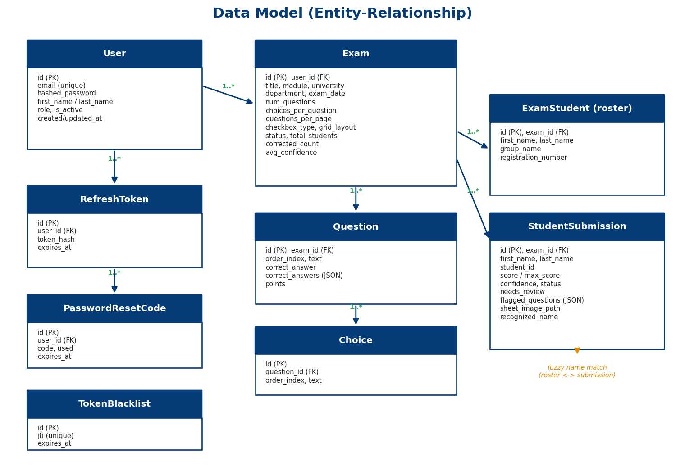

# Pocket OMR — Backend

Backend of **Pocket OMR**, an end-to-end Optical Mark Recognition system that grades
multiple-choice exam sheets photographed with an ordinary smartphone. No scanner and no
dedicated hardware: a teacher creates an exam, prints the answer sheets, photographs the
filled sheets, and gets every student's grade back automatically.

This service is the core of the system. It exposes the REST API used by the React web app
and the Flutter mobile app, generates the printable sheets, stores the scans, and runs the
computer-vision pipeline that reads both the **answer bubbles** and the **handwritten
student name** on each sheet.



## What it does

- **Exam management** — teachers create exams with questions, answer keys and per-question
  points, and import the class roster from `.xlsx` / `.xls` / `.csv`.
- **Sheet generation** — produces printable PDF question sheets, answer grids and correction
  sheets, each carrying a QR code and alignment markers.
- **Automatic grading** — a photographed sheet (or a `.zip` of a whole class) is segmented,
  the student is identified from their handwriting, the bubbles are read, and the score is
  computed against the answer key.
- **Human review where it matters** — questions the model is unsure about, or that the
  student double-marked, are flagged for the teacher instead of being silently graded.
- **Results** — per-student results, average score and confidence per exam, and export to
  Excel.
- **Accounts** — JWT authentication with refresh-token rotation, logout revocation and
  password reset by email code.

## Grading pipeline



For each uploaded sheet:

1. **Precheck and store** — unreadable photos are rejected early; accepted images are saved
   to MinIO.
2. **Segment** — the page is located, oriented using the QR code and margin markers, warped
   to a canonical A4 canvas, cleaned of shadows, and cropped into a *personal info* region
   and an *answers* region (`app/recognition/sheet_pipeline_v11.py`).
3. **Read the name** — character boxes are detected, each handwritten character is
   classified by a MobileNetV3 CNN, and field rules correct look-alikes (`O`/`0`, `I`/`1`,
   `S`/`5`).
4. **Match the student** — the recognised name, group and registration number are
   fuzzy-matched against the roster with a weighted Levenshtein distance.
5. **Read the answers** — a YOLOv8 detector finds every bubble, the boxes are ordered into
   a question × choice grid, and a small CNN classifies each bubble as filled or empty.
6. **Score** — a question is correct when exactly one bubble is filled and it matches the
   key. Low-confidence or double-marked questions are flagged for review.
7. **Persist** — the result is saved as a `StudentSubmission` and the exam's totals are
   recomputed.

If any step fails, the sheet is kept as **pending** and can be graded again later with the
regrade endpoint. More detail is in [GRADING.md](GRADING.md).

| Scoring | Authentication |
|---|---|
|  |  |

## Tech stack

- **Framework**: FastAPI (Python 3.12), fully async
- **Database**: PostgreSQL 16, SQLAlchemy 2.0 (async) + asyncpg, Alembic migrations
- **Auth**: JWT (python-jose) + bcrypt (passlib)
- **Computer vision**: OpenCV, PyTorch (TorchScript models), Ultralytics YOLOv8
- **Object storage**: MinIO (scanned answer sheets)
- **PDF**: ReportLab
- **Tooling**: Docker + Docker Compose, pytest, Ruff

## Project structure



```
app/
├── api/v1/endpoints/   # REST endpoints: auth, exams, students, grading, pdf, health
├── schemas/            # Pydantic request/response models
├── services/           # Business logic: auth, exam, grading, roster, storage, pdf, email
├── models/             # SQLAlchemy models: user, exam, questions, submissions
├── recognition/        # OMR pipeline: segmentation, bubble grading, char model, fuzzy match
├── core/               # Configuration and security (JWT)
└── db/                 # Async session management
recognition_models/     # Trained models: YOLOv8 bubble detector, bubble CNN, MobileNetV3
alembic/                # Database migrations
tests/                  # pytest suite
scripts/                # Asset building, mock data seeding, documentation generator
```

Data model:



## Setup

### 1. Environment

```bash
cp .env.example .env
# Edit .env if needed (defaults work for local dev)
```

### 2. Start database and object storage

```bash
docker compose up -d pgsql minio
```

This starts PostgreSQL on port **5434** (database `omr_db_v2`) and MinIO on **9000**
(S3 API) / **9001** (web console). The `omr-sheets` bucket is created automatically on the
first sheet upload.

### 3. Python environment

```bash
python3 -m venv .venv
source .venv/bin/activate
pip install -r requirements.txt
```

### 4. Run migrations

```bash
PYTHONPATH=. alembic upgrade head
```

### 5. Run the server

```bash
fastapi dev app/main.py --port 8000
```

Or with uvicorn directly:

```bash
uvicorn app.main:app --reload --port 8000
```

Interactive API docs are then available at `http://localhost:8000/docs`.

### Full stack (Docker)

```bash
docker compose up -d
```

This starts PostgreSQL, MinIO, and the API server.

## Environment variables

| Variable | Default | Description |
|----------|---------|-------------|
| `API_PORT` | `8000` | Server port |
| `POSTGRES_USER` | `postgres` | DB user |
| `POSTGRES_PASSWORD` | `postgres` | DB password |
| `POSTGRES_DB` | `omr_db_v2` | DB name |
| `POSTGRES_HOST` | `localhost` | DB host |
| `POSTGRES_PORT` | `5434` | DB port |
| `JWT_SECRET_KEY` | *required* | JWT signing secret |
| `SMTP_EMAIL` | `""` | Gmail address for password-reset emails (optional) |
| `SMTP_PASSWORD` | `""` | Gmail app password (optional) |
| `MINIO_ENDPOINT` | `localhost:9000` | MinIO host:port |
| `MINIO_ACCESS_KEY` | `minioadmin` | MinIO access key (root user) |
| `MINIO_SECRET_KEY` | `minioadmin` | MinIO secret key (root password) |
| `MINIO_BUCKET` | `omr-sheets` | Bucket for scanned sheets |
| `MINIO_SECURE` | `false` | Use HTTPS for MinIO |

Model paths and grading thresholds (`BUBBLE_YOLO_PATH`, `BUBBLE_CNN_PATH`,
`BUBBLE_REVIEW_THRESHOLD`, …) are documented in [GRADING.md](GRADING.md).

## API endpoints

### Health
- `GET /health` - Health check
- `GET /health/db` - Database health check

### Auth (`/api/v1/auth`)
- `POST /register` - Register new teacher
- `POST /login` - Login
- `GET /me` - Get current user (Bearer token)
- `PUT /me` - Update profile: first/last name, email (Bearer token)
- `POST /refresh` - Refresh tokens
- `POST /logout` - Logout (Bearer token)
- `POST /send-reset-code` - Email a password-reset code
- `POST /verify-reset-code` - Verify a reset code
- `POST /reset-password` - Reset password with a valid code

### Exams (`/api/v1/exams`) — all Bearer token
- `POST /` - Create exam
- `GET /` - List user's exams
- `GET /{id}` - Get exam
- `PUT /{id}` - Update exam
- `DELETE /{id}` - Delete exam
- `GET /{id}/results.xlsx` - Export the exam's results to Excel

#### Mobile-facing
- `GET /recent` - Recently updated exams
- `GET /to-correct` - Exams still being corrected (`?search=`)
- `GET /history` - All exams with avg score/confidence (`?search=`)
- `GET /{id}/mobile` - Mobile-shaped exam with student results
- `POST /{id}/upload-images` - Upload scanned sheets (images or a `.zip` of images);
  each image is stored in MinIO, graded, and recorded as a `StudentSubmission`
- `DELETE /{id}/submissions/{submission_id}` - Remove one graded paper
- `POST /{id}/regrade` - Re-run grading on all pending submissions

### Students (`/api/v1/students`)
- `POST /parse-file` - Parse an uploaded `.xlsx`/`.xls`/`.csv` roster → student names

### Name recognition (no prefix, no auth)
- `POST /roster` - Upload the class list used for student matching
- `POST /grade` - Recognise the handwritten name fields of one or many sheets and match
  them to the roster

### PDF
- `POST /generate-pdf` - Generate PDF sheet: `question_sheet` | `grid_sheet` | `correction_sheet` (no auth)

## Migrations

```bash
# Create a new migration
PYTHONPATH=. alembic revision -m "describe change"

# Apply all migrations
PYTHONPATH=. alembic upgrade head

# Rollback one step
PYTHONPATH=. alembic downgrade -1

# Check current version
PYTHONPATH=. alembic current
```

## Tests

Requires a running PostgreSQL instance.

```bash
# Run all tests
PYTHONPATH=. pytest -v

# Run specific test file
PYTHONPATH=. pytest tests/test_auth.py -v

# Run a single test
PYTHONPATH=. pytest tests/test_auth.py::test_login_success -v
```

## Linting

```bash
ruff check app/ tests/
ruff check --fix app/ tests/
ruff format app/ tests/
```

## About the project

Pocket OMR was built as a pluridisciplinary project at the École Supérieure en Informatique
de Sidi Bel Abbès (2025/2026) by a team of six, supervised by Pr. Oussama Serhane. No public
dataset combines OMR bubbles with handwritten character labels, so the team designed its own
answer sheet, collected photographed sheets from volunteer students, and trained the models
on that data.

The system has three parts:

- **Backend** (this repository) — API, sheet generation and the grading pipeline
- **Web app** — React + Vite, for teachers to create exams, print sheets and export grades
- **Mobile app** — Flutter, for capturing sheets on site and reviewing results

### My contribution

<!-- TODO(Ines): replace with your own words before publishing -->
I worked on this backend: the exam and submission API used by the mobile app, the
integration of the recognition models into the grading service, sheet storage, and the
review-flag and regrade flow.
